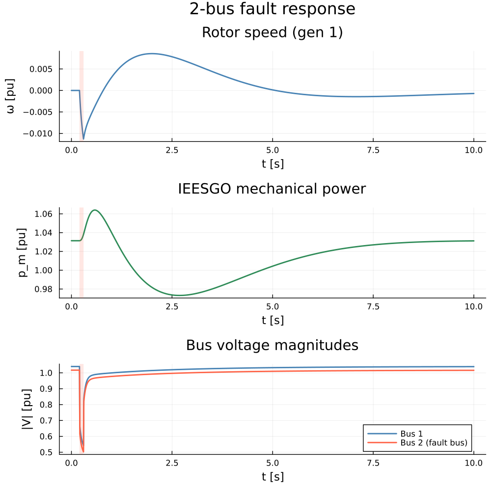

# GradPower.jl

[](LICENSE)

A Julia package for **differentiable power-system dynamic simulation**.

`GradPower.jl` parses standard PSS/E input files (`.raw` + `.dyr`), solves the
power flow, and integrates the differential–algebraic equations of a
multi-machine power system through fault contingencies. The whole pipeline is written so that
derivatives flow through it, enabling gradient-based optimization, sensitivity
analysis, and machine-learning-in-the-loop workflows.

## Features

- Read PSS/E `.raw` (network) and `.dyr` (dynamic) files; MATPOWER `.m` files
  for the static network.
- Sparse Newton power flow on the resulting system.
- Backward-Euler DAE integration through scheduled bus-fault contingencies.
- Struct-of-arrays state layout and per-device-type batched residual /
  Jacobian kernels, organized so the hot loop maps cleanly onto vectorized
  backends.
- Forward (tangent linear) and adjoint sensitivities through the integration
  scheme.

## Installation

`GradPower.jl` is not yet registered. Install from the repository:

```julia
julia> ]
pkg> add https://github.com/dynsytms/GradPower.jl
```

Or, for local development:

```julia
pkg> dev https://github.com/dynsytms/GradPower.jl
```

## Quick start

A complete fault-on-bus simulation on the bundled 2-bus case (GENROU
machine with an IEESGO governor):

```julia
using GradPower

# 1. Parse PSS/E network + dynamic data.
sys = GradPower.from_psse("examples/2bus.raw", "examples/2bus_IEESGO.dyr")

# 2. Build the admittance matrix and solve the power flow.
GradPower.build_network!(sys)
GradPower.runpf!(sys; verbose = false)

# 3. Allocate the dynamic problem and initialize states from the PF solution.
dprob = GradPower.DynamicProblem(sys)
GradPower.initialize_dynamics!(dprob, sys)

# 4. Schedule a 3-phase fault on bus 2: r_fault = 0.2 pu from t = 0.2 s to t = 0.3 s.
GradPower.add_event!(sys, GradPower.ContingencyEvent(2, 0.2, 0.2, 0.3))

# 5. Integrate to t_final = 10.0 s.
tvec, traj = GradPower.integrate!(dprob, sys, 10.0)
```

`traj` is a `(system_size × nsteps)` matrix laid out as
`[diff_states; alg_states; v_re/v_im per bus]`. For a single-generator GENROU
machine the diff block is `[e_qp, e_dp, phi_1d, phi_2q, ω, δ]`, so the rotor
speed of generator 1 is `traj[5, :]`. Bus voltage magnitude on bus `b` is
recovered from the trailing `[v_re, v_im]` pair:

```julia
diff_dim = sys.dynamic.diff_dim
alg_dim  = sys.dynamic.alg_dim
voff     = diff_dim + alg_dim
vre = traj[voff + 2*(b - 1) + 1, :]
vim = traj[voff + 2*(b - 1) + 2, :]
vm  = sqrt.(vre.^2 .+ vim.^2)
```

The trajectory below was produced from exactly this script:



## Repository layout

| Path | Contents |
| --- | --- |
| `src/`        | Package source |
| `examples/`   | PSS/E `.raw` / `.dyr` files and short driver scripts |
| `test/`       | Unit tests (`julia --project=. -e 'using Pkg; Pkg.test()'`) |
| `docs/`       | Design notes and generated assets |

## License

MIT. See [LICENSE](LICENSE).
